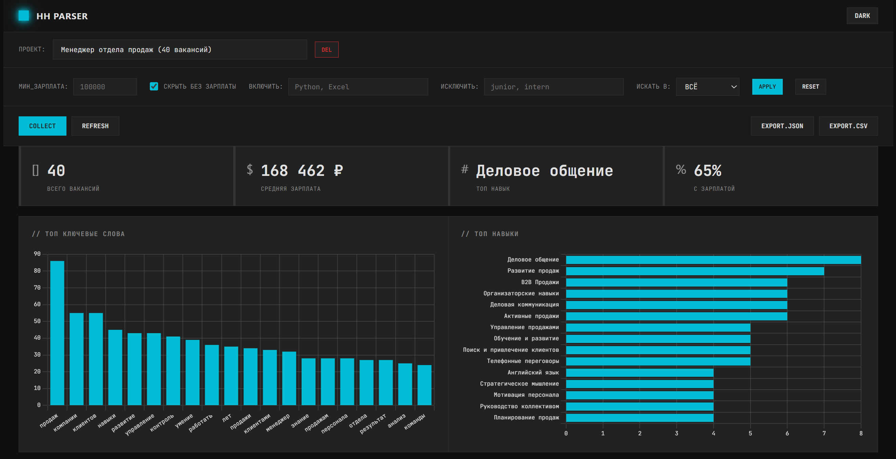
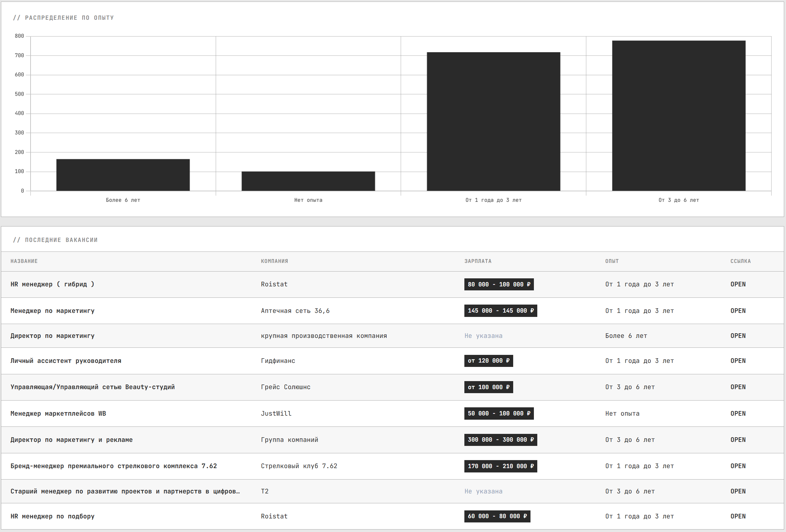

# HH.ru Parser

Веб-дашборд для сбора и анализа вакансий с HeadHunter.ru

## Скриншоты

### Dark Theme


### Light Theme


---

## Быстрый старт

```bash
# Windows - двойной клик или:
start.bat

# Или вручную:
py run.py
```

**Откроется:** http://localhost:5000

---

## Первая установка

```bash
# 1. Установить зависимости
pip install -r requirements.txt

# 2. Запуск
py run.py
```

---

## Возможности

### Сбор данных
- Парсинг вакансий через официальный HH.ru API
- Настраиваемые параметры поиска (регион, опыт, количество страниц)
- Система проектов для разных поисковых запросов

### Аналитика
- Статистика зарплат (средние значения, диапазоны)
- Топ ключевых слов из описаний вакансий
- Топ требуемых навыков
- Распределение по опыту работы

### Фильтрация
- Фильтр по минимальной зарплате
- Скрытие вакансий без указанной зарплаты
- Поиск по ключевым словам (включить/исключить)
- Область поиска: название, описание, навыки или везде

### Интерфейс
- Y2K Clinical Design - минималистичный технический стиль
- Переключение Light/Dark тем
- Интерактивные графики (Chart.js)
- Экспорт данных в JSON/CSV

---

## Структура проекта

```
hh-parser/
├── start.bat           # Запуск одной кнопкой
├── run.py              # Главный файл
├── app.py              # Flask backend
├── requirements.txt    # Зависимости
├── config/
│   └── config.yaml     # Настройки API
├── src/                # Модули парсера
│   ├── api_client.py  
│   ├── parser.py
│   ├── analyzer.py
│   └── storage.py
├── templates/          # HTML шаблоны
├── static/             # CSS/JS
├── screenshots/        # Скриншоты
└── data/               # SQLite база данных
```

---

## Как использовать

### 1. Запуск
```bash
start.bat  # или py run.py
```

### 2. Создать проект
- Открой http://localhost:5000
- Нажми "COLLECT"
- Поставь галочку "СОЗДАТЬ НОВЫЙ ПРОЕКТ"
- Введи название и параметры поиска
- Нажми "START"

### 3. Анализ результатов
- Переключайся между проектами в выпадающем списке
- Применяй фильтры для детального анализа
- Смотри графики и статистику
- Экспортируй данные в JSON/CSV

---

## Конфигурация

`config/config.yaml`:
```yaml
api:
  base_url: https://api.hh.ru
  user_agent: HH-Parser/1.0
  
search:
  query: "руководитель отдела маркетинга"
  area: 1    # 1=Москва, 2=СПб, 113=Россия
  max_pages: 10
  per_page: 20
```

---

## API Endpoints

| Метод | Endpoint | Описание |
|-------|----------|----------|
| GET | `/` | Главная страница |
| GET | `/api/stats` | Статистика с фильтрами |
| GET | `/api/vacancies` | Список вакансий |
| GET | `/api/projects` | Список проектов |
| POST | `/api/projects/{id}/switch` | Переключить проект |
| DELETE | `/api/projects/{id}` | Удалить проект |
| POST | `/api/collect` | Запуск сбора |
| GET | `/api/status` | Статус сбора |
| GET | `/api/export/json` | Экспорт JSON |
| GET | `/api/export/csv` | Экспорт CSV |

---

## Troubleshooting

### Python не найден?
```bash
py --version  # Должно быть 3.8+
```

### Порт 5000 занят?
Измени в `app.py` последней строке:
```python
app.run(port=5001)  # Любой свободный порт
```

### База заблокирована?
Закрой все процессы Python и перезапусти

---

## Лицензия

MIT

---

**Создано для анализа рынка труда**
